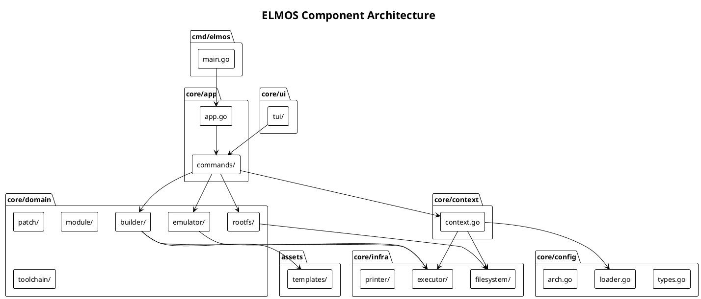
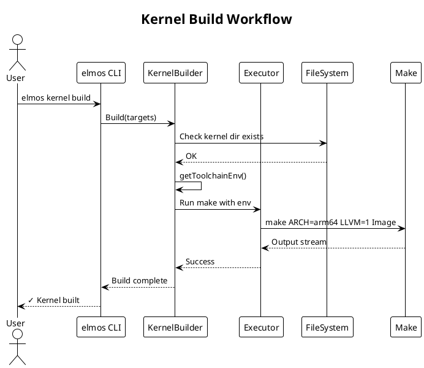
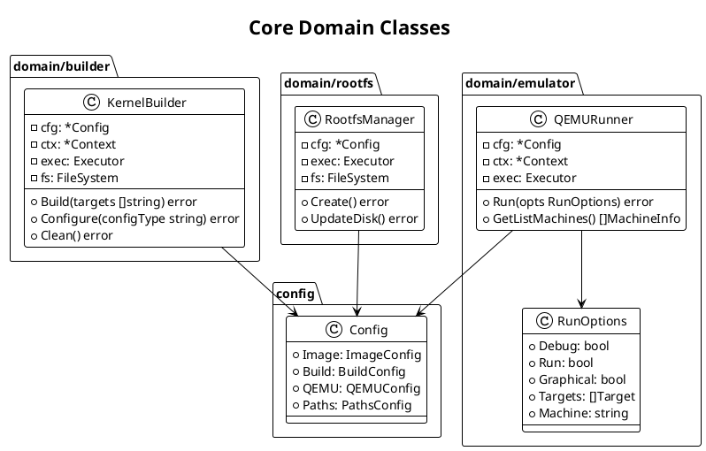
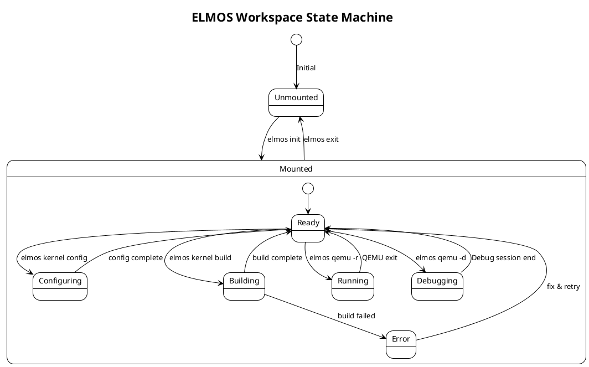
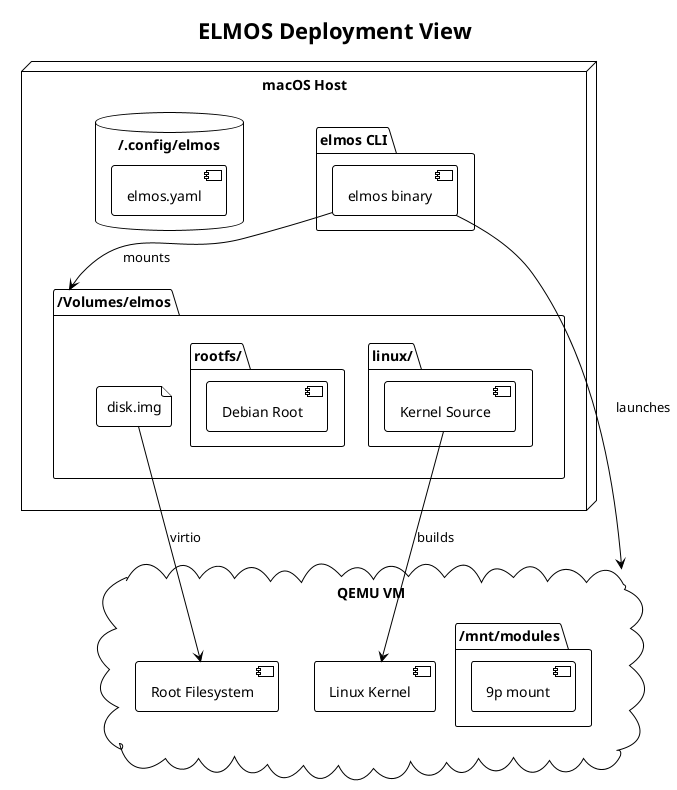

# Architecture Diagrams

This page contains visual diagrams of the ELMOS architecture.

---

## GUI Architecture

## GUI Build Sequence

## Platform Abstraction

## Component

High-level component architecture showing package relationships.

---

## Sequence

Kernel build workflow sequence.

---

## Class

Core domain class relationships.

---

## State

Workspace state machine.

---

## Deployment

Runtime deployment architecture.

