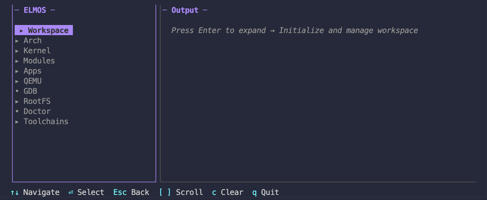

# ELMOS Documentation

<p align="center">
  <strong>Embedded Linux on MacOS</strong><br>
  A complete embedded Linux SDK for native kernel development on macOS.
</p>

---

## Features

| Feature                  | Description                                  |
| ------------------------ | -------------------------------------------- |
| 🔧 **Native Toolchains**  | Build cross-compilers for ARM64, ARM, RISC-V |
| 🐧 **Kernel Automation**  | Clone, configure, build Linux kernels        |
| 🖥️ **Interactive TUI**    | Rich terminal interface                      |
| 🚀 **QEMU Integration**   | Boot and debug with GDB                      |
| 📦 **Module Development** | Cross-compile kernel modules                 |

---

## Quick Start

```bash
# Install
brew tap NguyenTrongPhuc552003/elmos
brew install elmos

# Initialize workspace
elmos init

# Build kernel
elmos kernel config defconfig
elmos kernel build

# Run in QEMU
elmos qemu -r
```

---

## Documentation

### [User Guide](user/index.md)

For users installing and using ELMOS:

- [Installation](user/installation.md) - Setup prerequisites
- [Getting Started](user/getting-started.md) - First kernel build
- [Kernel Building](user/kernel-building.md) - Build configurations
- [QEMU Integration](user/qemu-integration.md) - Running and debugging
- [Troubleshooting](user/troubleshooting.md) - Common issues

### [Developer Guide](developer/index.md)

For contributors:

- [Architecture](developer/architecture.md) - System design
- [Diagrams](developer/diagrams.md) - Visual architecture
- [Build System](developer/build-system.md) - Task automation
- [Code Patterns](developer/code-patterns.md) - Go idioms
- [Contributing](developer/contributing.md) - Guidelines

---

## CLI Overview

<!-- elmos_tui.png -->


---

## Support

- [GitHub Issues](https://github.com/NguyenTrongPhuc552003/elmos/issues) - Bug reports
- [Discussions](https://github.com/NguyenTrongPhuc552003/elmos/discussions) - Questions

---

*MIT Licensed. Inspired by [Seiya's tutorial](https://seiya.me/blog/building-linux-on-macos-natively).*
